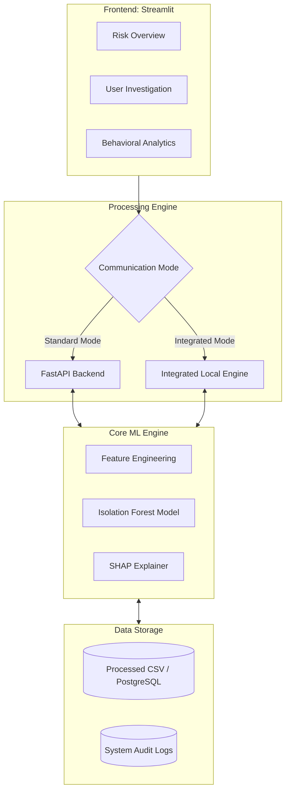
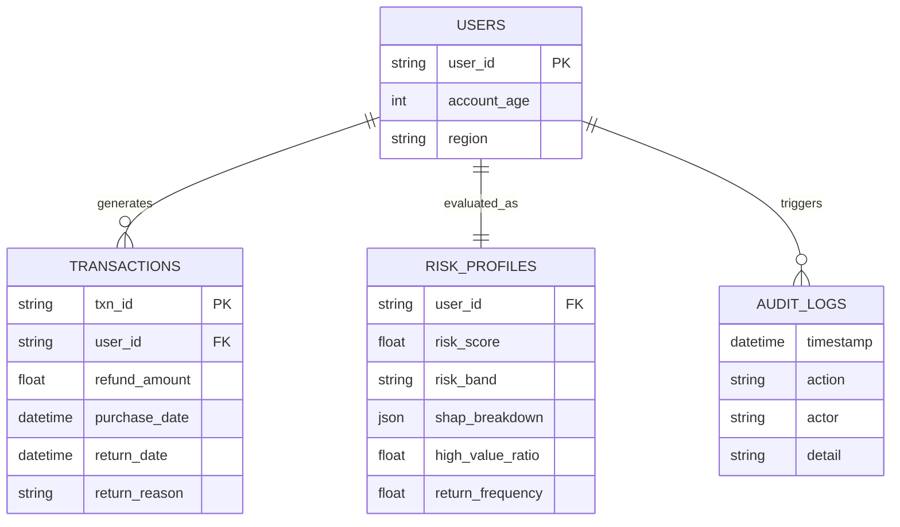

# 🛡️ RevGuard: Explainable Returns Fraud Detection Dashboard

**Detect. Score. Explain.**  
A high-performance machine learning system designed to identify, quantify, and explain fraudulent return behaviors in e-commerce ecosystems using Unsupervised Anomaly Detection.

---

## 📖 Table of Contents

- [Project Overview](#-project-overview)
- [✨ Key Features](#-key-features)
- [🏗️ System Architecture](#️-system-architecture)
- [📊 Behavioral Analytics](#-behavioral-analytics)
- [🧠 Machine Learning Engine](#-machine-learning-engine)
- [🗄️ Data Architecture (ERD)](#️-data-architecture-erd)
- [🚀 Deployment & Execution](#-deployment--execution)
- [📂 Project Structure](#-project-structure)

---

## 🎯 Project Overview

Returns fraud costs retailers billions annually. RevGuard moves beyond static, rule-based flagging by focusing on **behavioral deviations**. By analyzing patterns in return frequency, item value ratios, and timing anomalies, the system isolates high-risk "serial returners" and professional fraud rings that traditional systems often miss.

---

## ✨ Key Features

- **Hybrid Execution**: Runs as a distributed system (FastAPI + Streamlit) or a standalone integrated application.
- **Explainable AI (SHAP)**: Every fraud flag includes a "Why was this user flagged?" breakdown.
- **Behavioral Analytics**: Grouped visualization of return patterns across risk bands.
- **Dynamic Scoring**: Real-time 0-100 risk scoring based on Isolation Forest anomaly detection.
- **Audit Ready**: Comprehensive logging of all system and investigator actions.

---

## 🏗️ System Architecture

RevGuard uses a modern, modular architecture that supports both local development and cloud-native deployment.



---

## 📊 Behavioral Analytics

The dashboard provides a **Behavioral Comparison** view, simplifying complex multivariate data into actionable insights:

- **Return Frequency**: Average percentage of orders returned.
- **High-Value Item Ratio**: Average percentage of refunds involving high-value items.
- **Risk Grouping**: Automated classification into _Low_, _Medium_, and _High_ risk cohorts.

---

## 🗄️ Data Architecture (ERD)

The system's data model is designed for high-throughput behavioral analysis.



---

## 🚀 Deployment & Execution

### 1. Local Development (Distributed Mode)

Recommended for development with a persistent API layer.

```bash
# Terminal 1: Start Backend
python3 backend/main.py

# Terminal 2: Start Frontend
streamlit run app.py
```

### 2. Standalone / Cloud Deployment (Integrated Mode)

Best for Streamlit Cloud, Heroku, or standalone containers.

```bash
streamlit run app.py
```

_In this mode, the app automatically initializes the ML pipeline if the API is unreachable._

### 🛠️ Prerequisites

```bash
pip install -r requirements.txt
```

---

## 📂 Project Structure

```text
Fraud-Detection-Dashboard/
├── backend/
│   ├── main.py          # FastAPI Application
│   └── ml/
│       └── pipeline.py  # Core ML & Feature Engineering
├── data/
│   └── processed/       # Source behavioral datasets
├── app.py               # Streamlit Dashboard (Hybrid)
├── requirements.txt      # Production dependencies
└── README.md            # Technical Documentation
```

```
video link = https://drive.google.com/drive/folders/17G3Y2mYPOTWt4FJYFtxBuhost4v0oR-D?usp=drive_link
```

---

_Built for production-grade returns fraud mitigation._
