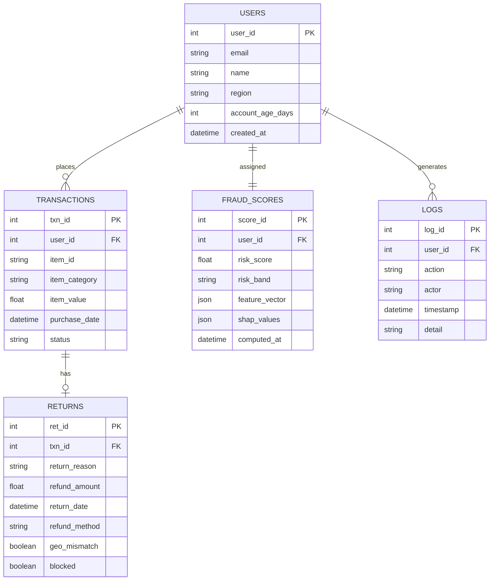

# Explainable AI-Powered Returns Fraud Detection Dashboard

A machine learning system for detecting, scoring, and explaining fraudulent return behavior in e-commerce platforms.

---

## Table of Contents

- [Project Overview](#project-overview)
- [Key Features](#key-features)
- [System Architecture](#system-architecture)
- [Machine Learning Approach](#machine-learning-approach)
- [Database Schema (ER Diagram)](#database-schema-er-diagram)
- [UML Component Diagram](#uml-component-diagram)
- [ML Pipeline](#ml-pipeline)
- [Dashboard Metrics](#dashboard-metrics)
- [User Risk Categorization](#user-risk-categorization)
- [Logs and Monitoring](#logs-and-monitoring)
- [Tech Stack](#tech-stack)
- [Project Structure](#project-structure)

---

## Project Overview

E-commerce return fraud costs the retail industry billions annually. Unlike payment fraud, return fraud is difficult to detect because every individual return is technically a legitimate business action — the pattern of behavior across time is what reveals abuse.

Common fraud patterns include:

- **Serial returners** — customers who systematically return most purchases
- **Wardrobing** — purchasing items for temporary use and returning them
- **Receipt manipulation** — claiming refunds for items not purchased or at inflated values
- **High-value item abuse** — repeatedly returning expensive goods under policy loopholes
- **Geolocation mismatch** — returns initiated from locations inconsistent with purchase origin

Rule-based systems fail here because fraudulent users exploit the system just within policy limits. What is needed is an anomaly detection system that learns behavioral deviation and explains why a specific user is flagged — enabling investigators to act without blindly trusting a black-box score.

This system combines **Isolation Forest anomaly detection**, **behavioral feature engineering**, and **SHAP-based explainability** to produce audit-ready, human-understandable fraud risk profiles.

---

## Key Features

| Feature                      | Description                                                |
| ---------------------------- | ---------------------------------------------------------- |
| CSV Transaction Ingestion    | Upload raw transaction and return logs via dashboard       |
| Real-Time User Search        | Search any user by ID or email for instant fraud profile   |
| AI Risk Score (0–100)        | Isolation Forest–based normalized anomaly score            |
| Risk Band Classification     | Automatic Low / Medium / High risk categorization          |
| Financial Impact Estimation  | Total refund exposure attributed to risky users            |
| Loss Recovery Tracking       | Tracks blocked or reversed suspicious refunds              |
| Fraud Distribution Analytics | Visual breakdown of fraud vs legitimate users              |
| Explainable AI Insights      | SHAP-based top feature contributions per flagged user      |
| User Investigation Panel     | Complete behavioral summary for selected user              |
| Behavioral Timeline View     | Chronological purchase and return activity                 |
| Risk Threshold Control       | Adjustable sensitivity for fraud detection                 |
| Behavioral Feature Heatmap   | Cluster-level visualization of fraud patterns              |
| Audit Logging System         | Records system actions, scoring events, and admin activity |


---


```

**Request Flow**

```
User Action
  --> Streamlit Frontend (Python)
    --> FastAPI Backend  (auth + routing)
      --> ML Engine      (feature engineering + scoring)
        --> PostgreSQL   (persist results)
          --> Backend    (format API response)
            --> Frontend (render updated dashboard)
```

---

## Machine Learning Approach

### Feature Engineering

| Feature | Formula |
|---|---|
| Return Frequency | total_returns / total_orders |
| Return Velocity (30d) | count of returns in last 30 days |
| Avg Time-to-Return | mean(return_date - purchase_date) in days |
| High-Value Item Ratio | high_value_returns / total_returns |

| Account Age | days since account creation |
| Geolocation Mismatch Count | returns from IP regions != purchase region |


### Anomaly Detection

**Primary Model: Isolation Forest**

Isolation Forest partitions the feature space randomly. Anomalous users are isolated in fewer steps, producing higher anomaly scores. No ground-truth labels are required; contamination parameter controls expected fraud proportion.

**Optional Supervised Layer: Logistic Regression**

If labeled fraud data is available, Logistic Regression is trained on engineered features to calibrate the final score.

**Imbalanced Data Handling**

- SMOTE for supervised path
- Class weighting in Logistic Regression
- Contamination tuning in Isolation Forest

### Risk Score Formula

```
Raw Anomaly Score   <- Isolation Forest decision_function output
Normalized Score    <- MinMax scaling to [0, 100]

Final Risk Score = weighted_sum(
    0.40 * normalized_anomaly_score,
    0.20 * return_frequency_score,
    0.15 * high_value_item_score,
    0.15 * geolocation_risk_score,
    0.10 * timing_anomaly_score
)


---

## Database Schema (ER Diagram)

### Mermaid ER Diagram




---

## ML Pipeline

```
+----------------------+
|  Raw CSV Upload      |  <- Admin uploads transaction log
+----------+-----------+
           |
           v
+----------+-----------+
|  Data Validation     |  <- Schema check, null removal, dedup
+----------+-----------+
           |
           v
+----------+-----------+
|  Feature Engineering |  <- Compute behavioral features per user
+----------+-----------+
           |
           v
+----------+-----------+
|  Train / Test Split  |  <- 80/20 split on user-level data
+----------+-----------+
           |
           v
+----------+-----------+
|  Isolation Forest    |  <- Unsupervised anomaly detection
+----------+-----------+
           |
           v
+----------+-----------+
|  Anomaly Scores      |  <- Raw decision_function output
+----------+-----------+
           |
           v
+----------+-----------+
|  Score Normalization |  <- Map to 0-100 range
+----------+-----------+
           |
           v
+----------+-----------+
|  Risk Band Assignment|  <- Low / Medium / High
+----------+-----------+
           |
           v
+----------+-----------+
|  SHAP Explainability |  <- Per-user feature contribution
+----------+-----------+
           |
           v
+----------+-----------+
|  Store to Database   |  <- Persist fraud_scores + logs
+----------+-----------+
           |
           v
+----------+-----------+
|  Dashboard Render    |  <- Streamlit frontend renders updated dashboard
+----------------------+
```

---

## Dashboard Metrics

| Metric | Calculation |
|---|---|
| Total Transactions | COUNT(*) from transactions table |
| Total Fraud Detected | COUNT(users) WHERE risk_band = 'High' |
| Total Financial Loss | SUM(refund_amount) WHERE risk_band = 'High' |
| Total Loss Recovered | SUM(refund_amount) WHERE blocked = TRUE |
| Fraud Rate % | (High Risk Users / Total Users) * 100 |
| Risk Accuracy | Precision = TP / (TP + FP) on labeled validation set |

---

## User Risk Categorization

```
Score Range    Band           Recommended Action
-------------------------------------------------------------------
0  - 40        Low Risk       No action. Standard monitoring.
41 - 70        Medium Risk    Flag for manual review. Soft hold.
71 - 100       High Risk      Escalate. Block refund. Investigate.
```

**Investigator Workflow**

1. Search a user by ID or email from the dashboard
2. View risk score, band, and top SHAP contributing factors
3. Review behavioral timeline — return dates, amounts, item categories
4. Read audit logs for all historical actions on the account
5. Decide to clear, escalate, or block based on evidence

The Medium band exists specifically to prevent direct auto-blocking of borderline cases, reducing false positives and supporting fair treatment.

---

## Logs and Monitoring

| Event Type | What is Logged |
|---|---|
| User return submitted | Timestamp, refund amount, method, geo-data |
| ML pipeline run | Start time, end time, total users scored |
| Threshold change | Old value, new value, admin ID |
| User flagged | Score, band, top SHAP factors |
| Investigator search | Admin ID, searched user ID, timestamp |
| Refund blocked | User ID, amount, blocking reason |
| Admin login | Admin ID, IP address, timestamp |

Logs serve as an audit trail for compliance, model accountability, and fraud dispute resolution.

---

## Tech Stack

| Layer | Technology |
|---|---|
| Frontend | Python, Streamlit, Plotly, Folium |
| Backend | Python, FastAPI |
| ML | scikit-learn, SHAP, pandas, numpy |
| Database | PostgreSQL |
| Auth | JWT (PyJWT) |
| Deployment | Docker, Docker Compose |

---

## Project Structure

```
⁠ 
fraud-detection-dashboard/
├── data/
│   ├── raw/             # Uploaded CSV transaction logs
│   └── processed/       # Engineered behavioral features
├── models/              # Serialized model artifacts (.pkl)
├── src/                 # Core logic: feature engineering & ML utilities
├── app.py               # Streamlit dashboard entry point
└── README.md            # Project documentation
 ⁠
```

---

*Built for hackathon submission — engineering-first, explainability-driven, production-minded.*
