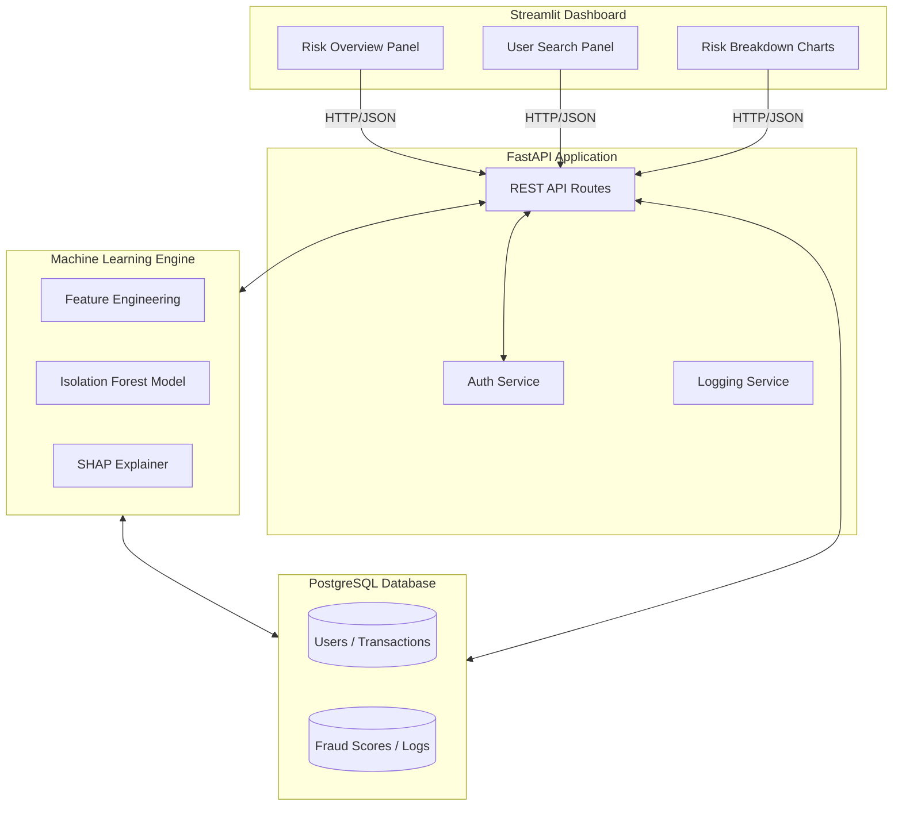
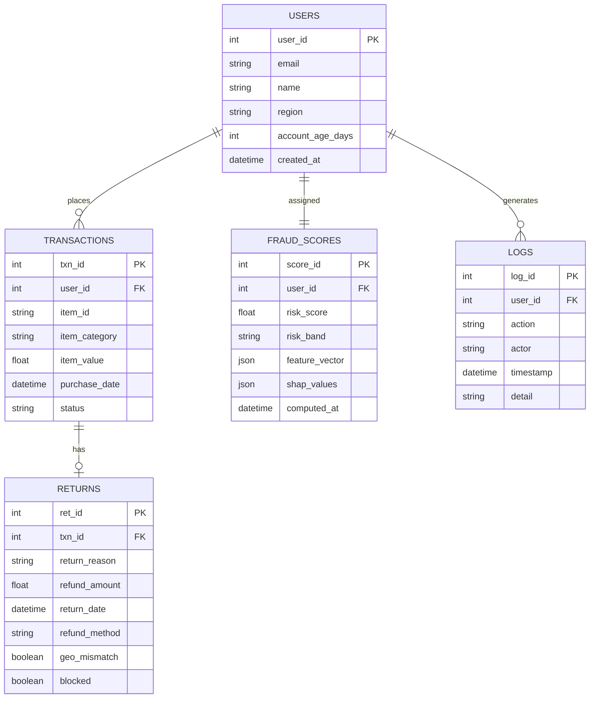
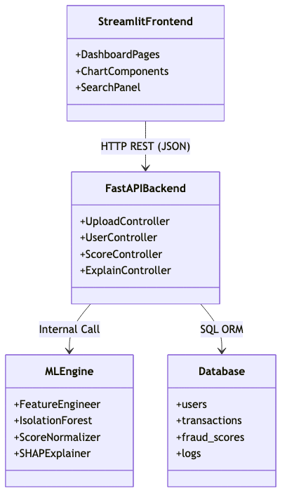
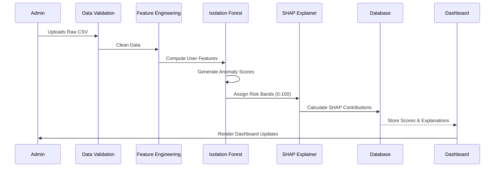

# 🛡️ RevGuard: Explainable Returns Fraud Detection Dashboard

<div align="center">
  <p><strong>A machine learning system for detecting, scoring, and explaining fraudulent return behavior in e-commerce platforms.</strong></p>
</div>

---

## 📖 Table of Contents
- [Project Overview](#-project-overview)
- [✨ Key Features](#-key-features)
- [🏗️ System Architecture](#️-system-architecture)
- [🧠 Machine Learning Approach](#-machine-learning-approach)
- [🗄️ Database Schema](#️-database-schema)
- [🧩 UML Component Diagram](#-uml-component-diagram)
- [📊 ML Pipeline](#-ml-pipeline)
- [🔍 User Risk Categorization](#-user-risk-categorization)
- [🛠️ Tech Stack](#️-tech-stack)
- [📂 Project Structure](#-project-structure)

---

## 🎯 Project Overview

E-commerce return fraud costs the retail industry billions annually. Unlike payment fraud, return fraud is difficult to detect because every individual return is technically a legitimate business action — the pattern of behavior across time is what reveals abuse.

Common fraud patterns include:
- **Serial returners** — Customers who systematically return most purchases.
- **Wardrobing** — Purchasing items for temporary use and returning them.
- **Receipt manipulation** — Claiming refunds for items not purchased or at inflated values.
- **High-value item abuse** — Repeatedly returning expensive goods under policy loopholes.
- **Geolocation mismatch** — Returns initiated from locations inconsistent with purchase origin.

This system bypasses the limitations of rigid, rule-based flagging by focusing on **behavioral deviations**. It combines **Isolation Forest anomaly detection**, **behavioral feature engineering**, and **SHAP-based explainability** to produce audit-ready, human-understandable fraud risk profiles.

---

## ✨ Key Features

| Feature | Description |
|---|---|
| **CSV Transaction Ingestion** | Upload raw transaction logs via dashboard. |
| **Real-Time User Search** | Look up any user by ID or email for instant profile. |
| **Risk Score (0-100)** | Normalized anomaly score per user. |
| **Risk Band Classification** | Automatic Low / Medium / High categorization. |
| **Top Fraud Risk Factors** | SHAP-derived per-user explanation of flag reasons. |
| **User Investigation Panel** | Full behavior profile for any searched user. |
| **Behavioral Timeline** | Chronological return and purchase activity. |
| **Audit Logs** | Every system and user action is recorded. |

---

## 🏗️ System Architecture



---

## 🧠 Machine Learning Approach

### 1. Feature Engineering
Raw transaction data is transformed into user-level behavioral metrics:
- **Return Velocity (30d):** Count of returns in the last 30 days.
- **Value Ratio:** Percentage of total spend that resulted in a refund.
- **Timing Anomaly:** Average time elapsed between purchase and return.
- **Geolocation Mismatch:** Returns from IP regions that do not match the purchase origin.

### 2. Anomaly Detection (Isolation Forest)
We use an unsupervised **Isolation Forest** model. Instead of looking for pre-defined fraud labels, the model isolates data points that are statistically "few and different." This allows the system to detect evolving fraud tactics that haven't been seen before.

### 3. Explainability (SHAP)
Every high-risk score is backed by a **SHAP breakdown**. This converts the "black box" model output into a human-readable list of factors.
Example: *“Flagged (Score 84) due to High-Value Item Ratio (+18) and Return Frequency (+32).”*

---

## 🗄️ Database Schema



---

## 🧩 UML Component Diagram



---

## 📊 ML Pipeline



---

## � User Risk Categorization

| Score Range | Risk Band | Recommended Action |
|-------------|-----------|--------------------|
| **0 - 40** | 🟢 Low | **Standard Monitoring:** No action required. |
| **41 - 70** | 🟡 Medium | **Manual Review Flagged:** Soft hold on returns. |
| **71 - 100** | 🔴 High | **Immediate Action:** Escalate and block refunds. |

---

## 🛠️ Tech Stack

- **Frontend:** Streamlit, Python, Plotly
- **Backend:** FastAPI, Python
- **Machine Learning:** scikit-learn, SHAP, Pandas, NumPy
- **Database:** PostgreSQL
- **Deployment:** Docker, Docker Compose

---

## 📂 Project Structure

```text
fraud-detection-dashboard/
├── data/
│   ├── raw/             # Uploaded CSV transaction logs
│   └── processed/       # Engineered behavioral features
├── models/              # Serialized model artifacts (.pkl)
├── src/                 # Core logic: feature engineering & ML utilities
├── app.py               # Streamlit dashboard entry point
└── README.md            # Project documentation
```

---
*Built for engineering-first, explainability-driven, and production-minded use cases.*