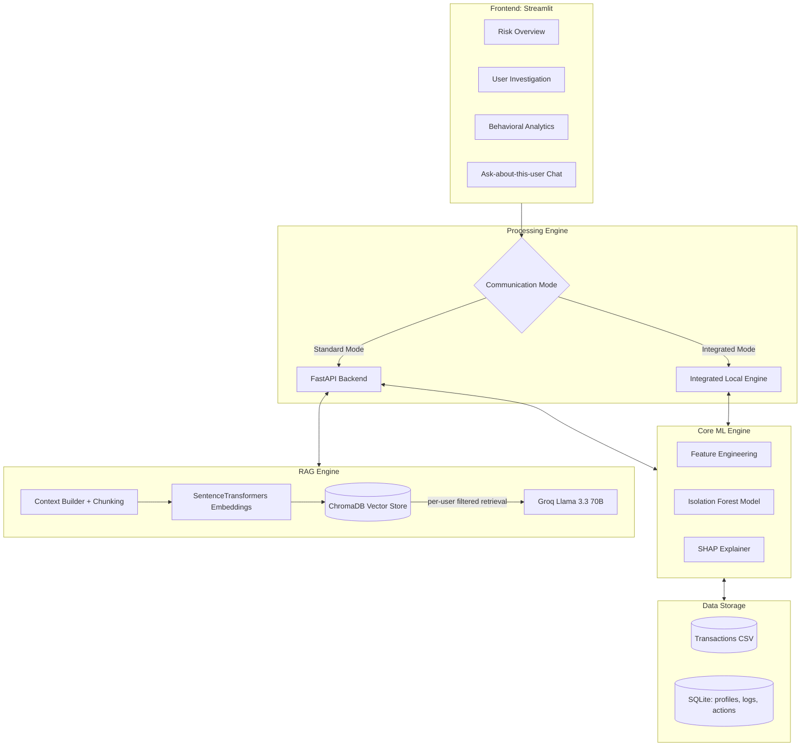

# RevGuard: Explainable Returns Fraud Detection Dashboard

**Detect. Score. Explain. Ask.**
An end-to-end machine learning system that identifies, quantifies, and explains fraudulent return behavior in e-commerce — unsupervised anomaly detection with SHAP explainability and a RAG-powered investigation assistant.

---

## Table of Contents

- [Project Overview](#project-overview)
- [Key Features](#key-features)
- [System Architecture](#system-architecture)
- [Machine Learning Engine](#machine-learning-engine)
- [Model Evaluation](#model-evaluation)
- [RAG Investigation Assistant](#rag-investigation-assistant)
- [Dataset](#dataset)
- [Data Architecture (ERD)](#data-architecture-erd)
- [Deployment & Execution](#deployment--execution)
- [Project Structure](#project-structure)

---

## Project Overview

Returns fraud costs retailers billions annually. RevGuard moves beyond static, rule-based flagging by focusing on **behavioral deviations**. By analyzing patterns in return frequency, item value ratios, and timing anomalies, the system isolates high-risk "serial returners" and refund abusers that rule-based systems miss — and explains every flag so investigators can act on it.

---

## Key Features

- **Explainable AI (SHAP)**: Every fraud flag includes a "Why was this user flagged?" per-feature breakdown.
- **RAG Investigation Assistant**: Ask free-form questions about any flagged user ("Why is this user high risk? What is their exposure?") — answers are generated by an LLM grounded strictly in that user's retrieved case context.
- **Evaluated, not just built**: Scored against held-out fraud labels — ROC-AUC 0.981, precision@50 of 0.66 ([details below](#model-evaluation)).
- **Dynamic Scoring**: 0–100 risk scoring from Isolation Forest anomaly detection, banded Low / Medium / High.
- **Hybrid Execution**: Runs as a distributed system (FastAPI + Streamlit) or a standalone integrated application.
- **Audit Ready**: SQLite persistence for risk profiles, pipeline runs, investigator actions, and system logs.

---

## System Architecture



---

## Machine Learning Engine

Six behavioral features are engineered per user (see `FraudPipeline.engineer_features`):

| Feature | Why it signals fraud |
|---|---|
| Return Frequency | serial returners return most of what they buy (denominator counts only orders >30 days old, so recent purchases don't dilute the rate) |
| High-Value Item Ratio | refund abusers target expensive items |
| Avg Time-to-Return | "wardrobing" shows unusually fast turnarounds |
| Reason Diversity | fraudsters recycle the same excuse |
| Days Active | fresh accounts with heavy returns are riskier |
| Top Reason Ratio | one dominant excuse is scripted behavior |

An **Isolation Forest** (unsupervised — no fraud labels needed) scores each user; decision scores are scaled to 0–100 and banded (Medium ≥ 41, High ≥ 71). **SHAP TreeExplainer** attributes each score to the six features for a transparent, auditable justification.

Trained artifacts are committed (`models/*.pkl`) so a fresh deployment cold-starts in ~1 second instead of retraining; a full retrain is one click in the dashboard.

Exploratory analysis of the data and features: [`notebooks/eda.ipynb`](notebooks/eda.ipynb).

---

## Model Evaluation

The model is unsupervised, but the synthetic dataset embeds ground truth: ~3% of users follow labeled fraud personas (*serial returner*, *high-value abuser*, *wardrober*). Labels are **never used in training** — only to evaluate the ranking afterwards in [`notebooks/evaluation.ipynb`](notebooks/evaluation.ipynb).

| Metric (962 scored users, 45 labeled fraudsters) | Value |
|---|---|
| ROC-AUC (risk score vs. label) | **0.981** |
| Average precision (base rate 0.047) | **0.618** |
| Precision@50 / Recall@50 | **0.66 / 0.73** |
| High band (42 users): precision / recall | **0.69 / 0.64** |
| Top-20 flagged users that are true fraudsters | **14/20** |

The notebook also includes a **contamination sensitivity sweep** (alert-volume vs. precision trade-off) and a **SHAP summary** showing which behaviors drive the flags.

**Honest caveat:** the personas are synthetic and engineered to be behaviorally distinct, so these numbers are an upper bound — the claim is "the pipeline correctly isolates the behaviors it was designed to catch," not a production fraud-catch rate.

---

## RAG Investigation Assistant

Investigators can ask natural-language questions about any user from the dashboard. Under the hood (`backend/rag/`):

1. **Context building** — the user's risk profile, SHAP breakdown, and transaction timeline are rendered into text and chunked by section.
2. **Indexing** — chunks are embedded with SentenceTransformers (`all-MiniLM-L6-v2`) and upserted into a persistent **ChromaDB** collection.
3. **Retrieval** — queries are embedded and matched with metadata filtering on `user_id`, so context from other users can never leak into an answer.
4. **Generation** — **Llama 3.3 70B** (via Groq) answers with a strict grounding prompt: if the retrieved context doesn't contain the answer, it says so instead of inventing one.

Requires `GROQ_API_KEY` in `.env` (see `.env.example`); the rest of the system works without it.

---

## Dataset

Synthetic, generated by [`src/generate_dataset.py`](src/generate_dataset.py) (seeded, reproducible):

- ~11,000 transactions across 1,500 users with realistic multi-order histories over 2023–2024
- ~3% of users follow one of three fraud personas; ground-truth labels are written to `data/processed/fraud_labels.csv` for evaluation only
- Integrity by construction: returns never predate purchases, prices are long-tailed past the $500 high-value threshold

Regenerate with `python3 src/generate_dataset.py`, then retrain from the dashboard or by running the pipeline.

---

## Data Architecture (ERD)

```mermaid
erDiagram
    USERS {
        string user_id PK
    }
    TRANSACTIONS {
        string order_id PK
        string user_id FK
        string item_id
        datetime purchase_date
        datetime return_date
        string return_reason
        float refund_amount
        string payment_method
        string receipt_id
    }
    RISK_PROFILES {
        string user_id FK
        float risk_score
        string risk_band
        json shap_breakdown
        float high_value_ratio
        float return_frequency
    }
    INVESTIGATOR_ACTIONS {
        string user_id FK
        string action_type
        string analyst_name
        string notes
    }
    AUDIT_LOGS {
        datetime timestamp
        string action
        string actor
        string detail
    }

    USERS ||--o{ TRANSACTIONS : "generates"
    USERS ||--|| RISK_PROFILES : "evaluated_as"
    USERS ||--o{ INVESTIGATOR_ACTIONS : "reviewed_in"
    USERS ||--o{ AUDIT_LOGS : "triggers"
```



Risk profiles, pipeline runs, investigator actions, and audit logs persist in **SQLite** (`backend/database.py`).

---

## Deployment & Execution

### Prerequisites

```bash
pip install -r requirements.txt
cp .env.example .env   # add GROQ_API_KEY to enable the RAG assistant
```

### 1. Local Development (Distributed Mode)

Recommended for development with a persistent API layer.

```bash
python3 backend/main.py       # FastAPI on :8001
streamlit run app.py          # dashboard
```

### 2. Standalone / Cloud Deployment (Integrated Mode)

Best for Streamlit Cloud or standalone containers.

```bash
streamlit run app.py
```

_In this mode, the app automatically initializes the ML pipeline if the API is unreachable._

**Demo video:** https://drive.google.com/file/d/1X1DNJvj-Y7QUrJRfzieUlPQguvepQWH7/view?usp=sharing

---

## Project Structure

```text
Fraud-Detection-Dashboard/
├── app.py                     # Streamlit dashboard (hybrid: API or integrated)
├── config.py                  # Central configuration (thresholds, paths, RAG settings)
├── backend/
│   ├── main.py                # FastAPI application (scoring, search, analytics, chat, logs)
│   ├── database.py            # SQLite persistence layer
│   ├── ml/
│   │   └── pipeline.py        # Feature engineering, Isolation Forest, SHAP
│   └── rag/
│       ├── context_builder.py # User case → text context + chunking
│       ├── vector_store.py    # SentenceTransformers + ChromaDB (per-user retrieval)
│       ├── llm_client.py      # Groq Llama 3.3 70B with grounding prompt
│       └── service.py         # answer_question orchestration
├── notebooks/
│   ├── eda.ipynb              # Data quality, feature distributions, correlations
│   └── evaluation.ipynb       # Ground-truth metrics, contamination sweep, SHAP summary
├── src/
│   └── generate_dataset.py    # Seeded synthetic data generator with fraud personas
├── data/processed/            # Transactions CSV + evaluation-only fraud labels
├── models/                    # Trained model + user feature cache (fast cold start)
└── requirements.txt
```
